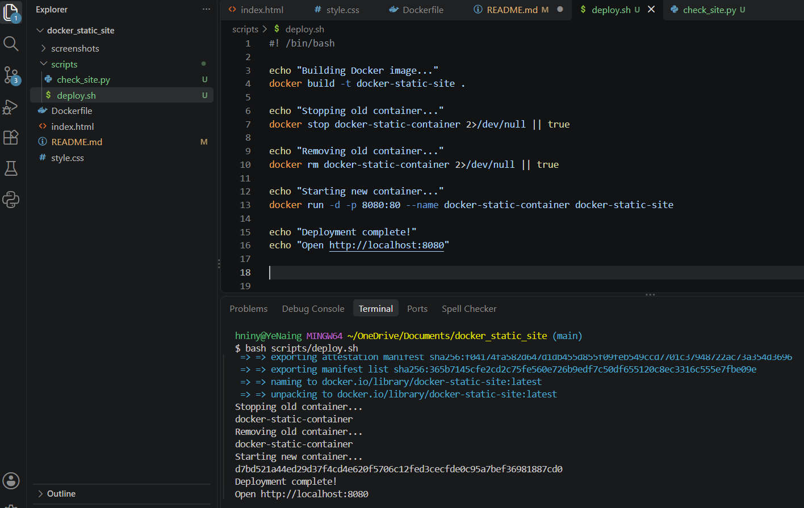
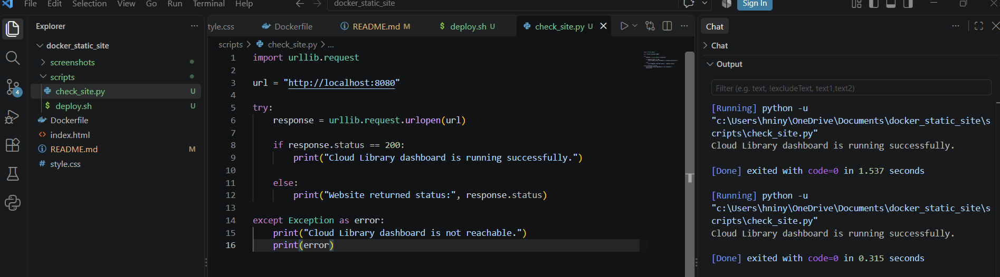

# Docker Cloud Library Mini Dashboard

## Project Description

This project is a simple Cloud Library mini dashboard built with HTML and CSS and containerized using Docker.

The website is served by Nginx inside a Docker container and runs locally on port 8080.

The dashboard includes simple library information such as:

- Member information
- Total books
- Borrowed books
- Available books

The purpose of this project is to practice Docker, Nginx, Git/GitHub, and basic DevOps workflow skills.

## Technologies Used

- HTML
- CSS
- Docker
- Nginx
- Git
- GitHub

## Project Structure

```text
docker_static_site/
|
|---index.html
|---style.css
|---Dockerfile
|---README.md
|---screenshots/
```
## Screenshots

### Cloud Library Mini Dashboard


### Successful Docker Build


### Running Docker Container


### Dockerfile


## Bash Automation

A Bash script is used to automate the Docker deployment process.

The script:
- Builds the Docker image
- Stops the old container
- Removes the old container
- Starts the updated container

Run the script with:

```bash
bash scripts/deploy.sh
```

## Python Health Check

A python script is used to check whether the Cloud Library dashboard is running successfully.

Run the script with:

```bash
python scripts/check_site.py
```
### Bash Deployment



### Python Health Check




