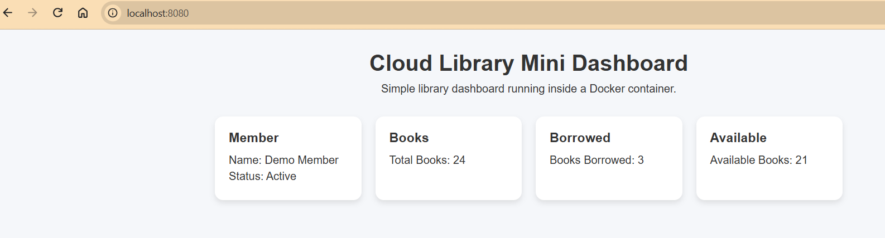
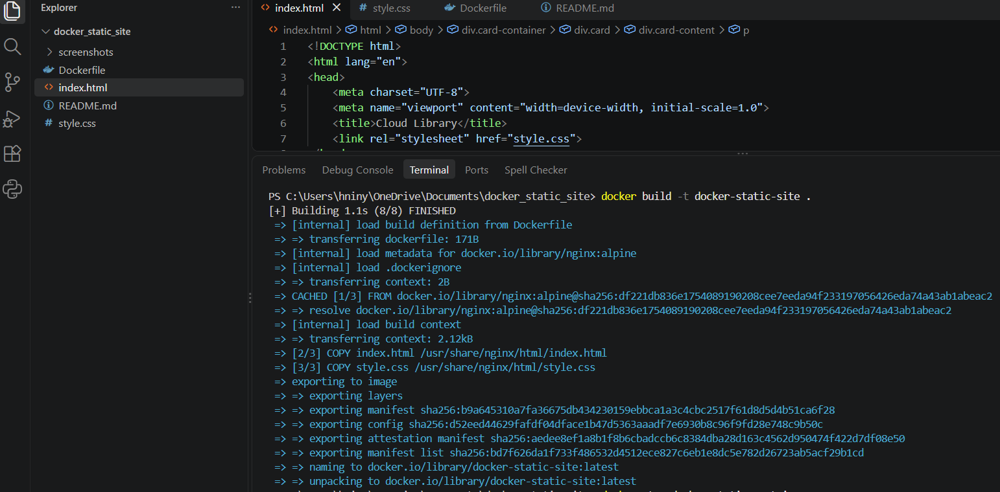
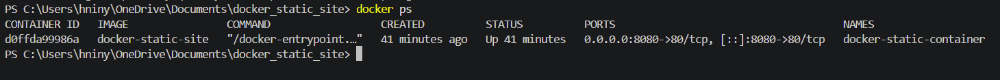
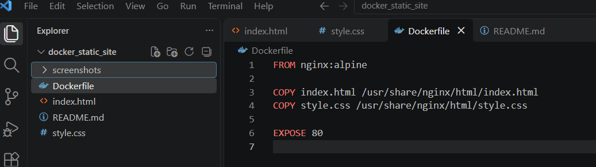

# Docker Cloud Library Mini Dashboard

## Project Description

This project is a simple Cloud Library mini dashboard built with HTML and CSS and containerized using Docker.

The website is served by Nginx inside a Docker container and runs locally on port 8080.

The dashboard includes simple library information such as:

- Member information
- Total books
- Borrowed books
- Available books

The purpose of this project is to practice Docker, Nginx, Git/GitHub, and basic DevOps workflow skills.

## Technologies Used

- HTML
- CSS
- Docker
- Nginx
- Git
- GitHub

## Project Structure

```text
docker_static_site/
|
|---index.html
|---style.css
|---Dockerfile
|---README.md
|---screenshots/
```
## Screenshots

### Cloud Library Mini Dashboard



### Successful Docker Build



### Running Docker Container



### Dockerfile


